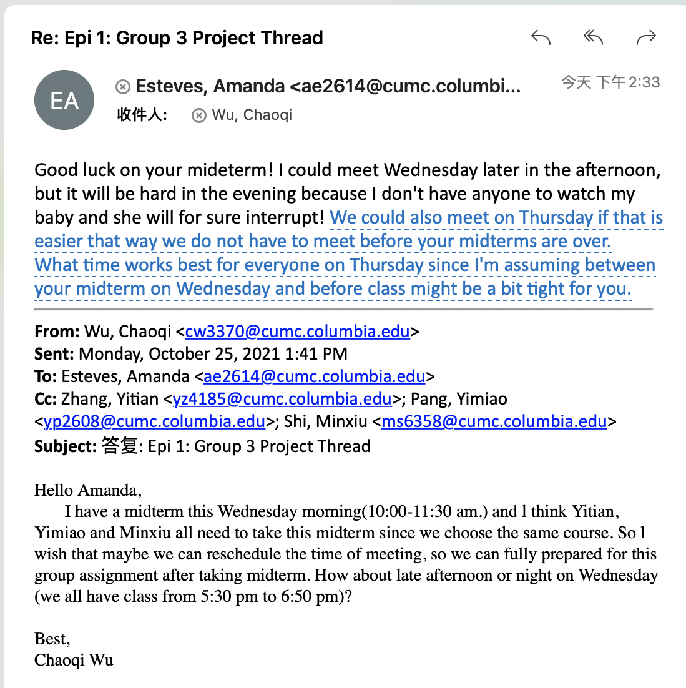

# This is Jeff's awesome website

l can link to useful things like
[google](https://www.google.com/) and [p8105](https://www.p8105.com)

l can make extra pages on my site and link to that. Here is my [about](about.html)

## Here's screenshot
this is a screenshot

